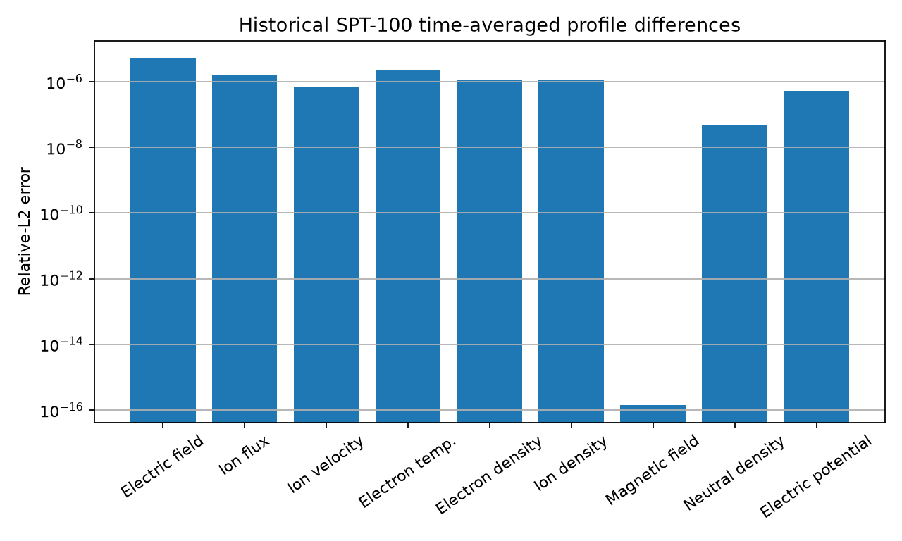
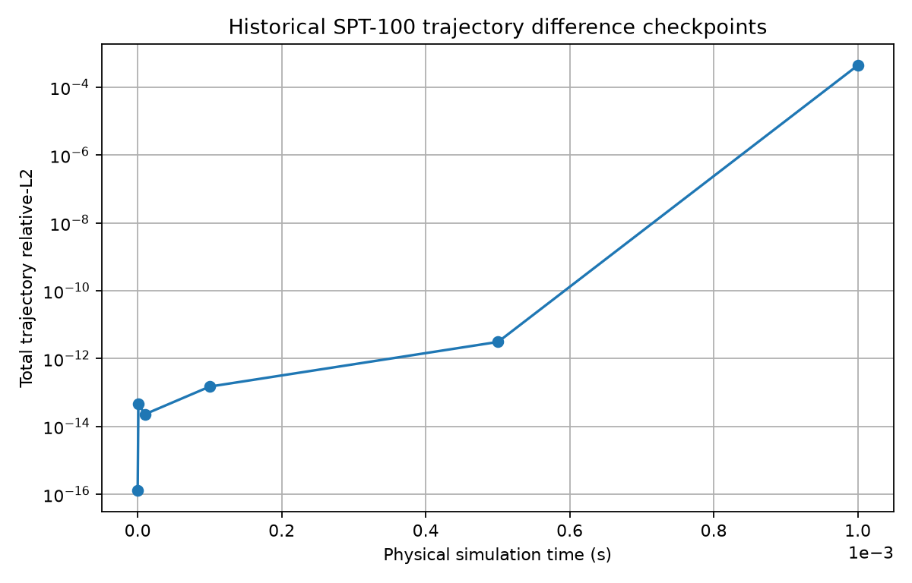

# HallThruster — Historical Python Translation & Validation

[](https://github.com/KouroshEsmaeili/HallThruster/actions/workflows/ci.yml)


[](https://github.com/UM-PEPL/HallThruster.jl)

This repository is a **historical Python translation and validation fork** of
[UM-PEPL/HallThruster.jl](https://github.com/UM-PEPL/HallThruster.jl), an open-source
1D fluid Hall thruster simulation code developed at the University of Michigan
Plasmadynamics and Electric Propulsion Laboratory.

The Python implementation in this fork is based on the HallThruster.jl
**v0.18.5-era** code at upstream commit
`014a12fb193af6927cb10f77da5e7baf215b5bc0`.

> [!IMPORTANT]
> This is **not an official Python release of HallThruster.jl** and it is not a
> claim of general scientific equivalence with current upstream HallThruster.jl.
> The original physical model, equations, numerical methods, SPT-100 regression
> case, and software architecture belong to the upstream HallThruster.jl project
> and its authors.

## What this fork adds

The work in this fork focuses on translating, repairing, packaging, and
validating the historical implementation in Python. The main additions are:

- a proper installable Python package under `src/hallthruster/`;
- Python 3.11+ packaging with `pyproject.toml`;
- translation fixes for Julia/Python semantic differences;
- deterministic Julia↔Python component validation;
- executable parity checks against the exact historical Julia source;
- a full historical SPT-100 regression validation;
- focused regression tests for confirmed translation bugs;
- checkpointed validation tooling for long Python runs;
- GitHub Actions CI for Python 3.11 and 3.12;
- reproducibility and validation documentation.

The original translation was created to make the framework easier to use from
Python. The later work in this repository turns that translation into a
reproducible, tested, and technically documented implementation.

## Validation status

The validation target is the exact historical HallThruster.jl commit:

```text
014a12fb193af6927cb10f77da5e7baf215b5bc0
HallThruster.jl 0.18.5 era
```

Current validated status:

| Validation layer | Result |
|---|---|
| Python test suite | `51 passed, 1 xfailed` |
| Tiny fixed-step smoke simulation | PASS |
| Python 3.11 CI | PASS |
| Python 3.12 CI | PASS |
| Julia↔Python component comparison | PASS at strict component tolerances |
| 20-cell fixed-step executable comparison | PASS |
| Historical 200-cell SPT-100 regression to `1e-3 s` | PASS under the original upstream regression criteria |
| Long-run strict instantaneous `1e-8` cross-language parity | Does not remain satisfied at the final state |

For the full historical SPT-100 case, Julia and Python both completed with:

- `172,613` accepted steps;
- `1,000` saved frames;
- reported final time `1e-3 s`;
- matching historical scalar acceptance criteria.

The long-duration solution develops a small, smooth phase separation late in
the run. Early and midpoint trajectories remain extremely close, while the
final instantaneous state no longer satisfies the strict `1e-8`
cross-language diagnostic. Time-averaged profiles and historical scalar
metrics remain within the documented validation envelope.

This limitation is reported explicitly rather than hidden by changing the
historical acceptance criteria.

See **[VALIDATION.md](VALIDATION.md)** for the complete methodology, numerical
errors, historical configuration, repaired translation discrepancies, and
scope limitations.

## Scientific results

The full 200-cell historical SPT-100 case completed in both languages with
172,613 accepted steps each. Both results pass the original historical
regression criteria, and the time-averaged profile differences are generally
around `1e-6` relative L2. A small late oscillatory phase drift is explicitly
documented; strict instantaneous long-run parity is not claimed. The current
pure-Python implementation is unoptimized and substantially slower than Julia.

See **[RESULTS.md](RESULTS.md)** for the concise scientific-results summary and
**[VALIDATION.md](VALIDATION.md)** for the authoritative validation record.





## Installation

Clone this fork and create a virtual environment:

```bash
git clone https://github.com/KouroshEsmaeili/HallThruster.git
cd HallThruster

python -m venv .venv
source .venv/bin/activate
python -m pip install --upgrade pip
python -m pip install -e ".[dev]"
```

On Windows PowerShell, activate the environment with:

```powershell
.venv\Scripts\Activate.ps1
```

The core package requires Python 3.11+ and NumPy. Optional extras are available
for visualization and LANDMARK-related tooling:

```bash
python -m pip install -e ".[visualization]"
python -m pip install -e ".[landmark]"
```

## Quick smoke test

Run the controlled tiny simulation used by CI:

```bash
python scripts/run_tiny_simulation.py
```

A successful run reports:

```text
retcode=success
requested_end_time=1e-07
actual_end_time=1e-07
saved_frames=3
finite_state_arrays=True
```

Run the regular test suite with:

```bash
python -m pytest -q
```

## Minimal Python example

```python
from hallthruster import Config, EvenGrid, SPT_100, SimParams, run_simulation

config = Config(
    thruster=SPT_100,
    domain=(0.0, 0.08),
    discharge_voltage=300.0,
    anode_mass_flow_rate=5e-6,
    neutral_temperature_K=500.0,
)

sim = SimParams(
    grid=EvenGrid(20),
    dt=1e-8,
    duration=1e-7,
    num_save=3,
    adaptive=False,
    verbose=False,
)

solution = run_simulation(config, sim)

print(solution.retcode)
print(solution.t[-1])
```

## Repository structure

```text
src/hallthruster/        maintained Python translation
tests/                   Python unit, parity, and regression tests
scripts/                 small executable Python smoke cases
validation/              Julia/Python exporters and comparators
RESULTS.md               concise scientific validation results
VALIDATION.md            detailed scientific/translation validation report
reactions/               reaction data inherited from upstream
landmark/                LANDMARK-related data inherited from upstream
python/                  inherited upstream Python helper/wrapper (not the translated solver)
test/                    inherited historical Julia test suite
docs/                    inherited upstream Julia documentation assets
paper/                   inherited upstream publication/thesis assets
ext/                     inherited Julia extension files
Project.toml             inherited historical Julia package metadata
```

The maintained Python implementation for this fork is **`src/hallthruster/`**.
The top-level `python/`, `test/`, `docs/`, `paper/`, `ext/`, and Julia
project metadata are retained as historical upstream/reference assets; they
should not be mistaken for the maintained Python package.

Generated validation JSON, raw-data plots, and long-run checkpoint files are
intentionally ignored rather than committed to the repository. The small
[summary figures](validation/results/README.md) are committed presentation
artifacts generated only from metrics recorded in `VALIDATION.md`.

## Reproducing the validation

Two validation layers are provided:

1. **Component/executable validation** under `validation/`, comparing Python
   results with an exact checkout of historical HallThruster.jl.
2. **Historical regression validation** under `validation/historical/`, using
   the original SPT-100 regression configuration.

Start with:

- [validation/README.md](validation/README.md)
- [validation/historical/README.md](validation/historical/README.md)
- [VALIDATION.md](VALIDATION.md)

The approximately six-hour pure-Python historical regression is deliberately
**not** part of normal CI. CI runs only the fast tests and controlled smoke
simulation.

## Scope and limitations

This repository validates a **historical translation**, not the current
HallThruster.jl codebase. In particular:

- the validation reference is upstream commit `014a12f`;
- current upstream HallThruster.jl features are not automatically ported;
- validation beyond the documented SPT-100 operating point is not claimed;
- runs longer than `1e-3 s` have not been established as equivalent;
- the Python implementation has not been performance-optimized;
- the unfinished translated JSON runner is not treated as a validated public
  interface.

For new scientific work, consult the actively maintained upstream project and
evaluate whether the current Julia implementation is more appropriate.

## Attribution

HallThruster.jl is the original project. The upstream project and its authors
remain the source of the physics, numerical formulation, regression case, and
original implementation architecture.

Original project:

- [UM-PEPL/HallThruster.jl](https://github.com/UM-PEPL/HallThruster.jl)
- [Official HallThruster.jl documentation](https://UM-PEPL.github.io/HallThruster.jl/dev)
- Marks, Schedler, and Jorns, *HallThruster.jl: a Julia package for 1D Hall
  thruster discharge simulation*, Journal of Open Source Software, 2023.

If you use the underlying HallThruster model or software in scientific work,
please cite the original HallThruster.jl publication. The repository retains
the upstream [CITATION.bib](CITATION.bib).

## License

The upstream HallThruster.jl project is distributed under the MIT License.
This fork retains the original license and copyright notice in
[LICENSE.md](LICENSE.md).

The license permits modification and redistribution while requiring the
original copyright and permission notice to be preserved.

## Maintainer of this fork

**Kourosh Esmaeili**

This fork's contribution is the historical Python translation work,
translation repair, packaging, reproducibility tooling, automated tests,
Julia↔Python validation, and CI around the original HallThruster.jl model.
