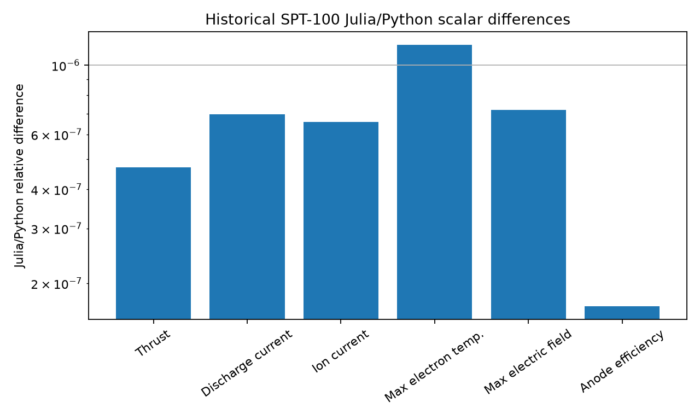

# Scientific Validation Results

## Validation target

- Historical HallThruster.jl v0.18.5-era implementation
- Exact upstream SHA `014a12fb193af6927cb10f77da5e7baf215b5bc0`
- Julia 1.10.11 versus Python 3.12.3
- Historical SPT-100 regression case
- 200 cells
- `1e-3 s` duration
- 1,000 saved frames

## End-to-end result

| Result | Julia | Python |
|---|---:|---:|
| Retcode | success | success |
| Final time | `1e-3 s` | `1e-3 s` |
| Accepted steps | 172,613 | 172,613 |
| Saved frames | 1,000 | 1,000 |

The Python translation successfully completed the same historical end-to-end
simulation as the Julia reference.

## Scientific outputs

| Quantity | Julia | Python | Relative difference |
|---|---:|---:|---:|
| Thrust | 87.30356894 mN | 87.30352788 mN | `4.702240e-7` |
| Discharge current | 4.613871731 A | 4.613868525 A | `6.948353e-7` |
| Ion current | 3.921837549 A | 3.921834971 A | `6.573864e-7` |
| Maximum electron temperature | 24.83210321 eV | 24.83213205 eV | `1.161662e-6` |
| Maximum electric field | 66646.07945 V/m | 66646.12744 V/m | `7.200894e-7` |
| Anode efficiency | 0.564569785 | 0.564569880 | `1.686929e-7` |

All fresh Julia and Python values pass the original historical
HallThruster.jl regression criteria.

## Time-averaged profiles

| Field | Relative-L2 error |
|---|---:|
| Electric field | `5.138842e-6` |
| Ion flux | `1.602786e-6` |
| Ion velocity | `6.659293e-7` |
| Electron temperature | `2.304299e-6` |
| Electron density | `1.092194e-6` |
| Ion density | `1.090252e-6` |
| Magnetic field | `1.418270e-16` |
| Neutral density | `4.775431e-8` |
| Electric potential | `5.186442e-7` |

The time-averaged scientific quantities are generally in the approximately
`1e-6` relative-L2 regime, with some profiles agreeing more closely.

## Long-run phase sensitivity

| Physical simulation time | Total trajectory relative-L2 |
|---:|---:|
| `0` | `1.274726e-16` |
| `1.001001e-6 s` | `4.554096e-14` |
| `1.001001e-5 s` | `2.283763e-14` |
| `1.001001e-4 s` | `1.495378e-13` |
| `5.005005e-4 s` | `3.105864e-12` |
| `1e-3 s` | `4.411136e-4` |

Early- and mid-run agreement is near floating-point scale. Differences grow
smoothly late in the oscillatory simulation; at the final instantaneous frame,
the maximum documented individual-field relative-L2 error is approximately
`1.302619e-3` for electric field. Strict instantaneous `1e-8` long-run parity
is therefore **not** claimed. The historical scalar regression and averaged
profiles nevertheless pass their original historical regression criteria.

## Runtime

| Implementation | Recorded context measurement |
|---|---:|
| Julia, first timed run | 31.6763 s |
| Julia, warmed timed run | 28.5281 s |
| Python, checkpointed run | 21,540.7 s (approximately 5.98 h) |

These measurements are not a controlled benchmark. The Python timing includes
checkpoint serialization, and no performance optimization was attempted. The
only performance conclusion supported here is that this historical pure-Python
translation is substantially slower than Julia.

## Translation defects found and repaired

The validated translation repairs include:

- uneven-grid inverse-CDF construction;
- tridiagonal copying for a non-mutating solve;
- historical Rusanov/HLLE sound-speed semantics;
- Julia IEEE Inf/NaN division behavior;
- excitation zero-energy handling;
- flat-slope reconstruction semantics;
- plume vectorized comparison behavior; and
- postprocessing and indexing issues.

See [VALIDATION.md](VALIDATION.md) for detailed provenance, the exact repairs,
and their regression tests.

## Claim boundary

This validates one exact historical SPT-100 configuration against
HallThruster.jl commit `014a12f`. It does not establish equivalence for:

- modern upstream versions;
- other thrusters or operating points;
- runs beyond `1e-3 s`;
- the unfinished JSON runner;
- performance; or
- all possible restart and configuration paths.
